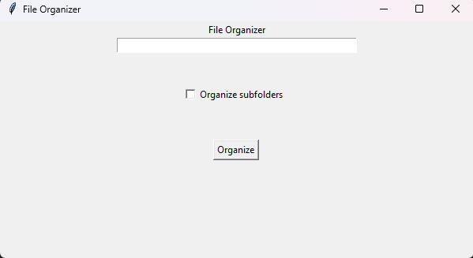

# 🗂️ File Organizer (Work in Progress)

A simple **Python GUI file organizer** built with **Tkinter**.  
It sorts files by **size** (Small / Medium / Large) and can optionally organize **subfolders recursively**.  
Built as a personal learning project to practice Python, file handling, and GUI design.

---

## 🚀 Features

- Organizes files in any chosen directory  
- Sorts files into:
  - `Small` — under 10 MB  
  - `Medium` — 10 MB to 250 MB  
  - `Large` — over 250 MB  
- Optional **recursive mode** to handle subfolders  
- GUI built with **Tkinter**  
- Real-time **progress bar** via `tqdm`  
- **Logging** for all moved files  

---

## 🖥️ How It Works

1. Run the script:
   ```bash
   python main.py
````

2. Enter or paste the folder path into the text box.
3. (Optional) Check **"Organize subfolders"** if you want recursive sorting.
4. Click **"Organize"** — your files will be moved into `Small`, `Medium`, and `Large` folders.

---

## 🧠 Tech Stack

* **Python 3**
* **Tkinter** (GUI)
* **tqdm** (progress bar)
* **logging** (activity logs)
* **os** / **shutil** (file management)

---

## 📦 To-Do / Future Plans

* [ ] Add error handling (invalid path, permissions, etc.)
* [ ] Add GUI progress bar
* [ ] Add file type-based sorting
* [ ] Add undo / restore option
* [ ] Add theme toggle (dark/light mode)
* [ ] Build executable (.exe) for Windows

---

## 🧰 Setup

1. Clone the repository:

   ```bash
   git clone https://github.com/YourUsername/file-organizer.git
   ```
2. Navigate to the folder:

   ```bash
   cd file-organizer
   ```
3. Install dependencies:

   ```bash
   pip install tqdm
   ```
4. Run it:

   ```bash
   python main.py
   ```

---

## 📸 Preview




---

## ✍️ Author

**Adda** — Student & aspiring Python developer.
Learning by building real, useful tools.


